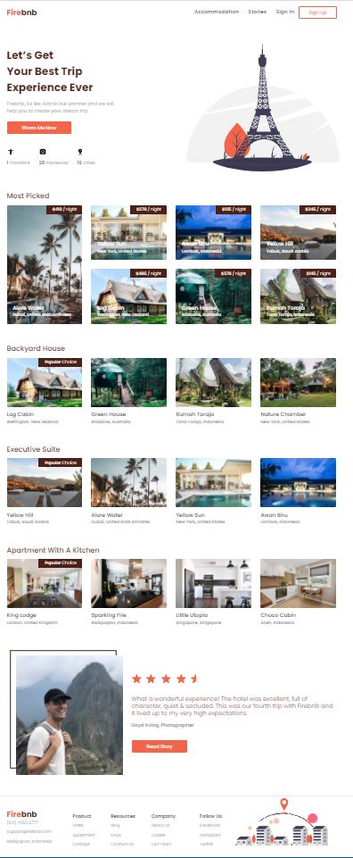
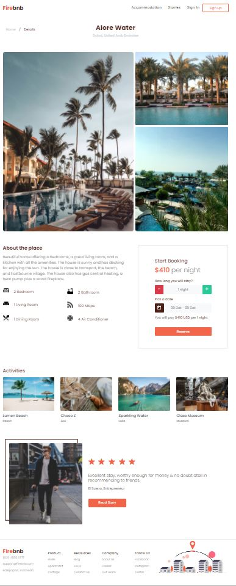
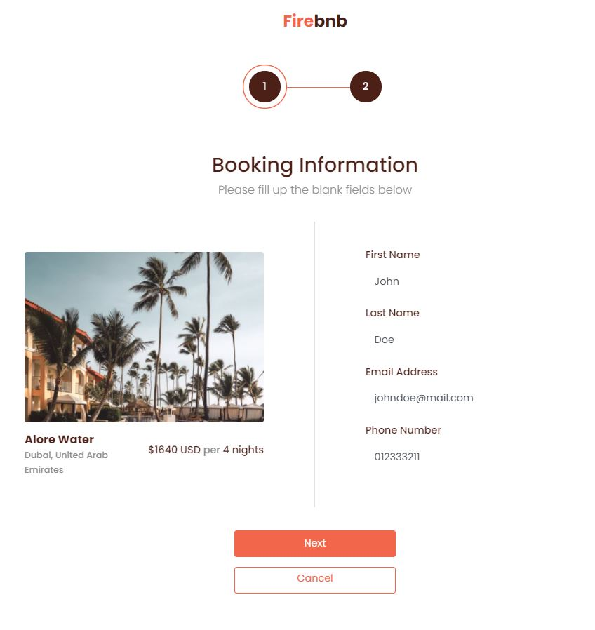
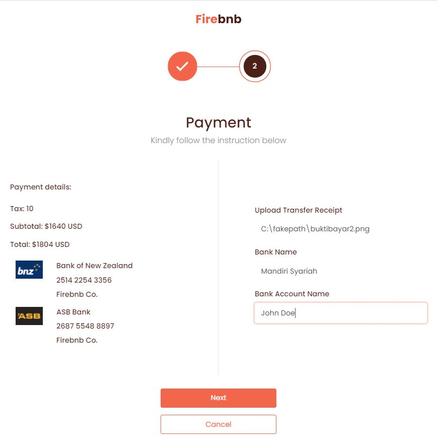
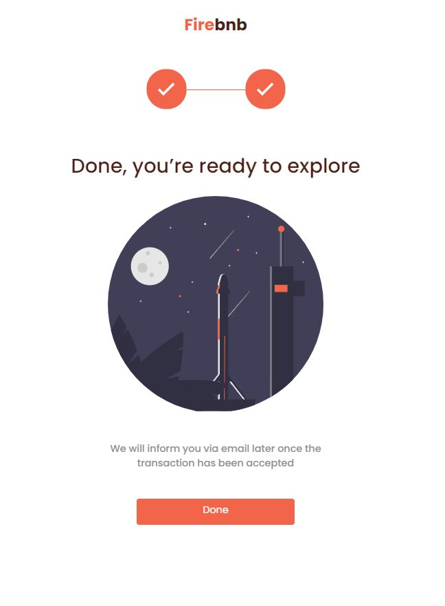

<h2 align="center"> <strong>FIREBNB REACT APP</strong></h2>

It's like Airbnb but warmer. The accommodation booking system built on top of MERN Stack. <br>
Go to [Firebnb Sysadmin & API Server Repo 🔗](https://github.com/metkerr/firebnb-server) to see the server source code.

## **Tech Stack**

- REACT JS
- SCSS
- Bootstrap
- REDUX

## **Usage**

### Install dependencies

```
npm install
```

### Run React app (Visit http://localhost:3000)

```
npm start
```

## **Screenshot**

### Landing Page



### Accommodation Detail Page



### Checkout Page - Booking information



### Checkout Page - Payment



### Checkout Page - Done


